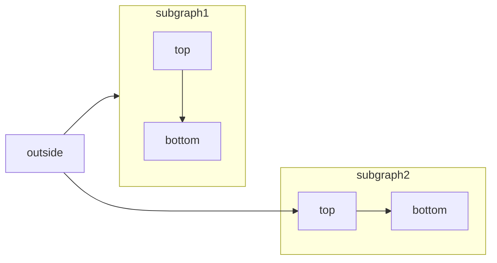

# Reception SOP

Welcome to the Reception Standard Operating Procedures (SOP).

This page outlines the key expectations and workflows for front desk and reception staff.

## Daily Tasks

- Greet every student and parent with a smile and eye contact.
- Check off attendance in Airtable.
- Handle new trial sign-ins and direct them to instructors.
- Keep the reception desk tidy and professional.

## Communication

- Always use polite, friendly language.
- Direct training-related questions to the head instructor.
- Report payment or system issues immediately.

## Emergencies

- Keep the emergency contact list visible.
- Know where the first aid kit and AED are located.
- In case of injury, alert the head instructor first.

````

````