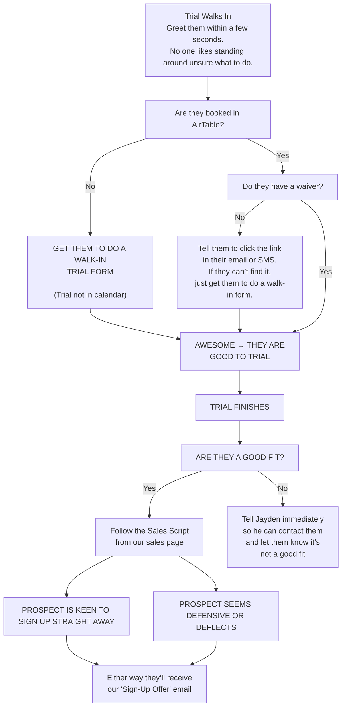

## Daily Tasks

<Steps>
  <Step title="Check Airtable for Any New Trials Today" stepNumber={1}>
    Before classes start, \*\*look in the Airtable Calendar \*\*for any new trial bookings.

    Before a new student comes in, you should already know:

    - The names of new students (and parents, if listed)
    - Whether they have completed their **waiver form**

    This helps them feel **expected and welcome**, and shows we’re **organised and professional**.

    <Warning>
      If you skip this step and make everyone fill out a walk-in form, a trial student might will get pitched twice - this feels awkward and unprofessional.
    </Warning>
  </Step>
  <Step title="Confirm New People Are Enrolled in Airtable" stepNumber={2}>
    If you see someone you **don’t recognise**, **ask their name immediately**.

    Don’t assume they’re signed up - even if they’ve been training for a few weeks.

    For anyone you’re unsure about, **check that they’re in Airtable** (specifically in the **CRM tab**).

    If someone is training but not listed in Airtable, it means they haven’t fully completed their sign-up form.

    This usually means they’re missing **payment details** or a **waiver** - both are big issues.

    Ask them to either:

    **1) Complete their sign-up** (they should have received an email prompting them to finish it), or

    **2) Redo their sign-up** completely on the gym iPad or their phone, and show you once it’s done.

    <Warning>
      Do not allow anyone to train without being properly enrolled in Airtable.
    </Warning>
  </Step>
  <Step title="Check Recently Churned Members" stepNumber={3}>
    Once a week, **look over the “Churned Members” list** in Airtable.

    This helps you catch anyone who cancelled but is still showing up to train.

    We’ve seen people cancel and keep training - this stops that from happening.
  </Step>
</Steps>

## What To Do If?

<AccordionGroup>
  <Accordion title="Trialist Is in Airtable - But They No-Showed">
    If a student is in Airtable but didn’t show up for their trial:

    **Tell Jayden in Facebook group chat ASAP.**
  </Accordion>
  <Accordion title="A Member Wants to Cancel, Pause, or Make Changes to Their Billing">
    They **must send an email** to request this.

    <Warning>
      No exceptions.

      **Do not accept:**

      Text messages

      Instagram or Facebook messages

      Verbal requests in the gym

      Parents asking through their kids

      **Pausing or cancelling without an email can cause serious problems, including:**

      Members thinking they can ignore the sign-up agreement

      Missed or incorrect billing

      Lost churn data (we can’t track cancellations properly)

      Missed exit surveys (we lose valuable feedback)
    </Warning>
  </Accordion>
  <Accordion title="A Teenager (Under 18) Wants to Enrol">
    Anyone under 18 cannot sign themselves up.

    Their parent or guardian - the person paying for the membership - must complete the sign-up.

    This rule protects us from issues like:

    - Failed payments or chargebacks
    - Legal complications with underage students signing waivers and agreements
  </Accordion>
  <Accordion title="Someone Wants To Pay Casually">
    **Absolutely not allowed under any circumstance.**

    Ask Jayden for further explanation.
  </Accordion>
  <Accordion title="A Member Is Training But Cannot Be Found In Airtable">
    Anyone who isn’t in Airtable would have either gotten an email an automatic email from us prompting them to complete their enrolment or they never did it. There is a small chance our email prompting them to finsh the sign up could have gone to spam. Tell them to check their email (including junk mail.)

    

    <Frame caption="Form abandonment email example">
      
    </Frame>
    

  </Accordion>
  <Accordion title="Someone Wants a Discount or Says They Can’t Afford Training">
    Do not negotiate prices.

    You teach your members how to treat you.

    Offering discounts or casual deals sets a precedent that we are:

    - Desperate for business
    - Willing to bend rules
    - Not enforcing our own policies
    - Unprofessional
    - Allowing members to dictate terms

    It is your responsibility to teach members how to treat you.

    We never offer discounts on memberships; except for families signing up three or more children.
  </Accordion>
  <Accordion title="A member wants to update their card or email etc">
  See **[Operations → Updating Member Details](Operations/updating-member-details)** for full instructions.
</Accordion>
  <Accordion title="Someone Walks In Without Having Talked To Jayden (They Are Not Booked in Airtable)">
    Ask them to complete a walk in Form
  </Accordion>
</AccordionGroup>

## Customer Journey

