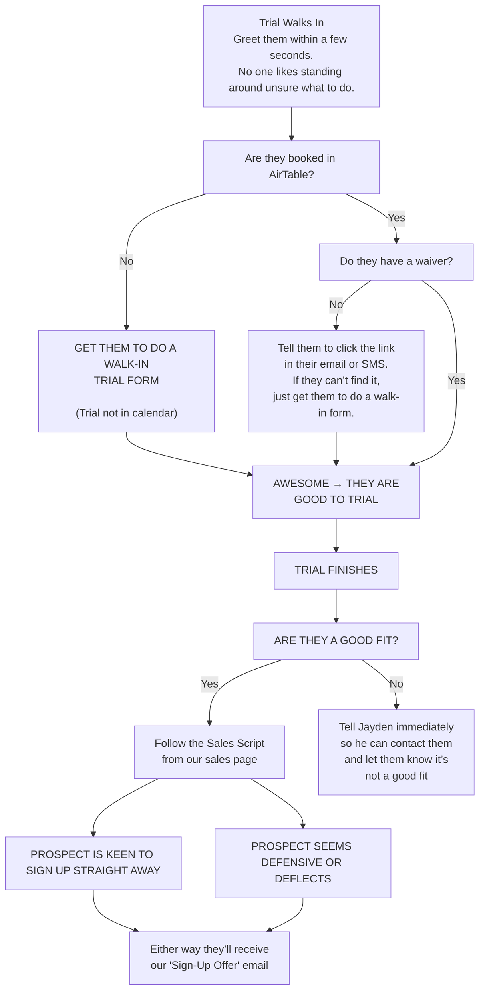

## Daily Tasks

<Steps>
  <Step title="Have I checked Airtable for any new trials that may be coming today?" stepNumber={1}>
    You should already know the names of new trialing students (or their parents names) and whether or not they’ve completed a waiver.

    If you don't bother to check and just make everyone do a walk in form, they will get email follow up twice - and that will come across as weird.
  </Step>
  <Step title="Have I introduced myself to anyone I don't know and confirmed they are in airtable?" stepNumber={2}>
    If they’re not in Airtable, it means they haven’t completed their sign-up. This could be due to missing payment details or waivers. Ask them to re-do their sign-up on the gym iPad or on their phone, and show you once it’s done.
  </Step>
  <Step title="Have I checked the current Churned Members List" stepNumber={3}>
    
  </Step>
</Steps>

## What To Do If?

<AccordionGroup>
  <Accordion title="Trial is in Airtable - but they no-show their trial">
    Tell Jayden ASAP - He will follow up and retarget
  </Accordion>
  <Accordion title="A member wants to cancel, pause, or make changes to their billing">
    They must send an email.

    <Warning>
      No exceptions.

      Please do not accept text messages, instagram/facebook messages, or people telling you about cancellation in the gym.\
      \
      Parents cannot ask their kids to ask us to pause their account. Parents must send an email.

      \
      Pausing or cancelling a membership without the client emailling us can result in:

      - Setting a precedent that they can ignore instructions they agreed to when they signed up
      - Pauses and cancellations being missed or billing incorrectly
      - We don't get to track their churn date (ruins data collection)
      - We don't get an oppurtunity for an exit survey (valuable feedback)
    </Warning>
  </Accordion>
  <Accordion title="A Teenager Under 18 Wants To Enrol">
    They cannot sign themselves up using someone else’s card — the cardholder must complete the sign-up themselves.
  </Accordion>
  <Accordion title="Someone Wants To Pay Casually">
    Not allowed under any circumstance.
  </Accordion>
  <Accordion title="A Member Is Training But Cannot Be Found In Airtable">
    Anyone who isn’t in Airtable would have either gotten an email an automatic email from us prompting them to complete their enrolment or they never did it. There is a small chance our email prompting them to finsh the sign up could have gone to spam. Tell them to check their email (including junk mail.)

    

    <Frame caption="Form abandonment email example">
      
    </Frame>
    

  </Accordion>
  <Accordion title="Someone Wants A Discount Or Says They Cannot Afford Training">
    
  </Accordion>
  <Accordion title="A member wants to update their card or email etc">
    See the operations page, updating member details
  </Accordion>
  <Accordion title="Someone Walks In Without Having Talked To Jayden (They Are Not Booked in Airtable)">
    Make them do a walk in Form
  </Accordion>
</AccordionGroup>

## Customer Journey

